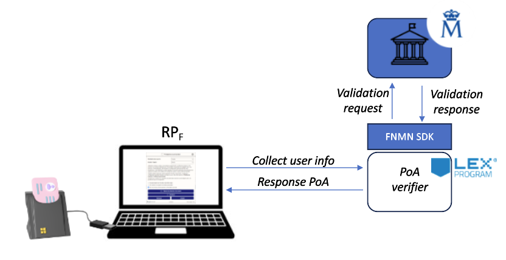

# Guidelines for PoA enabling through national identity cards

## Description

The following project aims to create a mechanism for verification of attributes, e.g. age, using national identity cards. This constitutes a project similar to the one that can be used in bookmakers or gambling houses, so that a specific attribute, such as age, can be verified.

## User stories

1. *As an user* who wants to consume a service of the Relying Party (RP), *I want to* insert my national card reader into a computer via usb/bluetooth *so that* when accessing a web page containing the Lex4Web banner (RP web), make a permission request from the browser to access the device.
2. *As Lex4Web banner*, *I want* to run a piece of code *so that* I can collect and send user identity information securely to verification microservices.
3. *As a Proof of Attributes (PoA) verifier*, *I want* to be able to use the FNMT SDK *so that* the attribute concerned, e.g. age can be verified.

## Software implementation requirements

1. The development will be hosted in a private repository.
2. An initial design stage must be carried out, which will have as deliverables, UML diagrams and flowcharts, for the data and process models respectively.
3. The development will be carried out on docker.
4. The backend programming language will be Python or NodeJS.
   4a. The SDK for accessing Spanish government services (FNMT) is in Java, so at least 2 containers are required: 1) Backend container, 2) Spanish public service requester.
5. CI/CD considerations must be taken into account using static code analysis tools such as SonarQube and vulnerability scanning tools such as Trivy.
6. Kubernetes manifests will be provided for production deployment, performing proper handling of secrets.

## Deliverables

1. Design: Flowcharts, UML diagrams.
2. Implementation: Source Code, Docker Container, Kubernetes Manifests and CI/CD pipeline.
3. Code security verification.

## Resources

1. [Source Code Java SDK supported by FNMT](https://www.ordenacionjuego.es/es/Kit-descarga-DNIe)