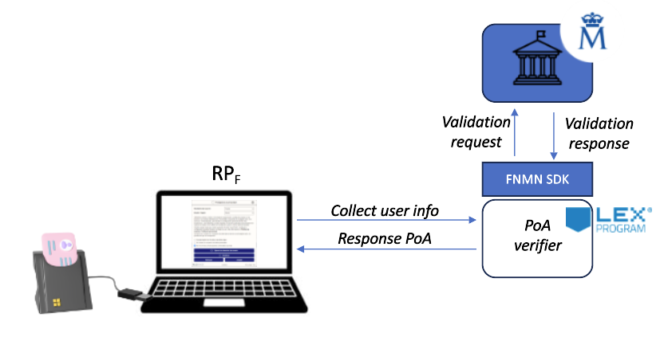

# Guidelines for PoA enabling through national identity cards

## Description

The following project aims to create a mechanism for verification of attributes, e.g. age, using national identity cards.

## Software Requirements

1. The development will be hosted in a private repository.
2. An initial design stage must be carried out, which will have as deliverables, UML diagrams and flowcharts, for the data and process models respectively.
3. The development will be carried out on docker.
4. The backend programming language will be Python or NodeJS.
   4a. The SDK for accessing Spanish government services (FNMT) is in Java, so at least 2 containers are required: 1) Backend container, 2) Spanish public service requester.
5. CI/CD considerations must be taken into account using static code analysis tools such as SonarQube and vulnerability scanning tools such as Trivy.
6. Kubernetes manifests will be provided for production deployment, performing proper handling of secrets.

## Deliverables