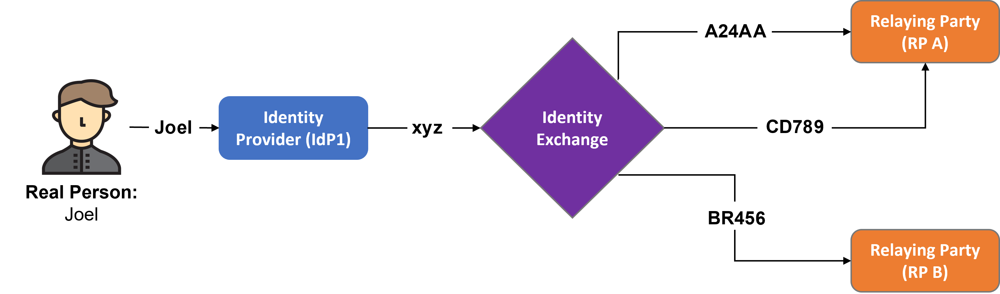

# Software Requirements

## Introduction

The Identity Exchange (IE) is an entity that acts as Broker Identity Federation that implement one time blind Proof of Existence (PoE) that establish that a real person is behind an account without reveling sensible user information. IE also use Proof of Attributes (PoA) to enable specific verification as part of the claims. As shown in the following figure, the entities that form part of the system are:

- User
- Identity Provider (IdP)
- Identity Exchange (IE)
- Relying Party (RP)

## Functional Requirements

1. **Setting up a trust chain**:

    - The IE must support different RP levels of assurances.
    - IE negotiate Identity Assurance Level and Authenticator Assurance with RP.
    - IE negotiate Federation Assurance Level with IdP.

2. **Integration on the consent banner**:

   - The IE access entry point is the consent banner that must be previously installed in the RP.
   - The user interface contained into the consent banner will directly display the IdPs supported by IE.

3. **Aproacch of information flow**

   1. The user discovers a relying party.
      1. The user access the RP with the intent to create an account and access services on the RP.
   2. The user creates an account on the RP and as the last step of account creation, the RP asks for access to identity information from a user through a trusted IE.
      1. The RP acting as the client, creates an authentication request including the scope parameters which includes any attributes requested, proof of attributes requested and the Level of Assurance (LoA) requirements. The authentication request includes:
         1. A redirect response created by the client, which triggers the user agent to make an authentication request to the OpenID Provider (OP) which is the IE in this context.
         2. This authentication request includes a client_id which is the client identifier, the scope , the redirect_uri where the client will receive the authentication response, the state which is a random string generated by the client to identify a session, prevent CSRF attacks and must be returned to the client in the authentication response, and other optional specifications.
   3. The IE logs the request from the RP and stores it against an identifier that it creates called the RP Link. The IE also validates the authentication request from the RP.
      1. This RP Link will be used to connect the information requested by the RP to the information provided by the IdP without either party knowing the identity of each other.
      2. The IE prompts the user to select an IdP. The user selects an IdP.
   4. Based on the selected IdP, the IX creates a Authentication Request for the selected IdP. Now the Exchange acts as a client and the IdP will be the OP. The IX will use all the information provided by the RP to create the scope . The authentication request includes:
      1. A redirect response created by the client (the IE now), which triggers the user agent to make an authentication request to the OpenID Provider (OP) which is the IdP now.
      2. This authentication request includes a `client_id` which is the client identifier (identifies the IE), the `scope`, the `redirect_uri` where the client will receive the authentication response, the state which is a random string generated by the client to identify a session, prevent CSRF attacks and must be returned to the client in the authentication response, and other optional specifications.
   5. The IdP validates that the authentication request came from the IE.
   6. The IdP prompts user to log into their account. The user provides necessary credentials to access their account on the IdP.
      1. There might be extra steps required for the user to satisfy the LoA requirements. These requirements will be specified in the `scope` of the authentication request. The Identity Assurance Level (IAL) or the Authenticator Assurance Level (AAL) might not be satisfied. The user will be required to meet the requirement levels by identity proofing mechanisms or adding multi-factor authentication to their IdP.
   7. An authentication response is returned to the client (the IX) which includes a code generated by the OP (the IdP) and the same `state` value provided by the client in the Authentication request in step 4.
      1. The authorization code called code is a random string issued by the IdP to be used in the request to the token endpoint - this is an endpoint at the OP (which in this step is the IdP). The OIDC has many code flows, for the purpose of this architecture I am using the Authorization code flow. The authorization code flow ensures that none of the tokens are exposed to the User Agent which removes the chance of any malicious applications on the User Agent being able to access the tokens.
   8. The IE validates the authentication response.
   9. Now, the IE creates a Token request which includes the `code` that was received in the authentication response in step 7, the `redirect_uri` which must match the value used in the authentication request in step 4, and the `client_assertion` which is the the signed client authentication JWT generated by the client(IE). The client must generate a new assertion JWT for each call to the token endpoint at the IdP.
      1. The signed JWT is a Json Web Token which has claims made by the IE and signed by it as well. These claims include `iss` which is the client ID of the client creating and issuing the JWT, the `aud` which is the URL of the OP’s (which is the IdP in this step) token endpoint, the `jti` which is a unique random identifier of the JWT and the date of creation and expiration.
   10. The IdP validates the Token request. The Token request is accepted when signature on the JWT (`client_assertion`) is validated using the IE’s registered public key.

### User Stories

| Category  | User Stories  |
|:---:|-------------|
| User  | *As an* user of the Relying Party (RP), *I want to* use the consent banner as an entry point *so that* I can log in to the Identity Exchanger (IE) through Proof of Existence (PoE) using e.g., FIDO2. |
| User  | *As an* Relying Party (RP) user, *I want to* use the consent banner as an entry point for the Proof of Attribute (PoA) *so that* it can be verified the actual value of the user's age using e.g., Google Authentication, eIDAS2. |
| User  | *As an* Relying Party (RP) user, *I want to* use the consent banner as an entry point for the Proof of Attribute (PoA) *so that* if a user is authenticated through the browser (e.g. in Google) the authentication is transferred to the Identity Exchange, allowing the verification process through the PoA. |
| Relaying Party  | *As a* Relying Party (RP), *I want to* be able to decide on both the Identity Assurance Level (IAL) and the Authenticator Assurance Level (AAL) supported by the Identity Providers (IdPs) *so that* the Identity Exchanger (IE) provides connectivity only to Identity Providers (IdPs) that meet these requirements. |
| Relaying Party  | *As a* Relying Party (RP), *I want to* be able to decide the Federation Assurance Level (FAL) supported by the Identity Exchanger (IE), *so that* I can select between the different Federation Assurance Levels (FAL) offered by the Identity Exchanger (IE). |
| Relaying Party | *As a* Relying Party (RP), *I want to* verify user consent from a Proof of Attribute (PoA), so the Identity Provider (IdP) and Identity Exchange (IE) must support these mechanisms or define third-party connectors that allow verifications to be performed. |
| Identity Provider  | *As an* Identity Provider (IdP), *I want to* authenticate the user from a Proof of Existence (PoE) based on Biometrics, *so that* the user must have an end device that supports standard FIDO2. |
| Identity Provider  | *As an* Identity Provider (IdP), *I want to* authenticate the user from a Proof of Existence (PoE) based on eIDAS2 Authentication, *so that* the user must be in possession of an eID. |

## Non-functional Requirements

- Performance: The software should respond to user actions within 2 seconds and support concurrent user access without significant performance degradation.

- Usability: The user interface should be intuitive and user-friendly, with clear navigation and consistent design.

- Reliability: The software should have a minimum uptime of 99% and provide error handling and data backup mechanisms.

- Security: User authentication should be implemented, and data should be encrypted during transmission and storage.

- Compatibility: The software should be compatible with popular web browsers (e.g., Chrome, Firefox, Safari) and responsive across different screen sizes.

- Scalability: The software should handle a growing number of users and projects without compromising performance

- Maintainability: The software should be modular, well-documented, and allow for future updates and enhancements.

## System Constraints

- Hardware Limitations: The software should be compatible with standard hardware configurations, including desktops, laptops, and mobile devices.

- Software Dependencies: The software should be developed using a specific programming language and framework (e.g., Python and Django) and utilize a relational database (e.g., PostgreSQL).

- Regulatory and Legal Requirements: The software should comply with relevant data privacy and protection regulations, such as GDPR.

## Assumptions and Dependencies

- Assumption: Users will have a reliable internet connection to access the software.

- Dependency: The software development team will have access to the required development tools and infrastructure.
